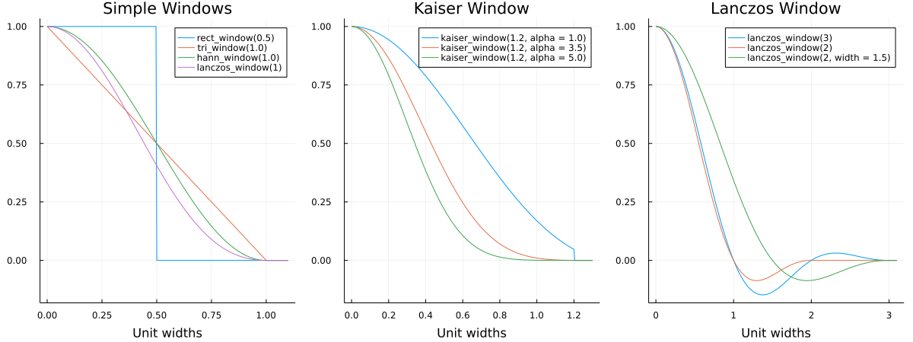
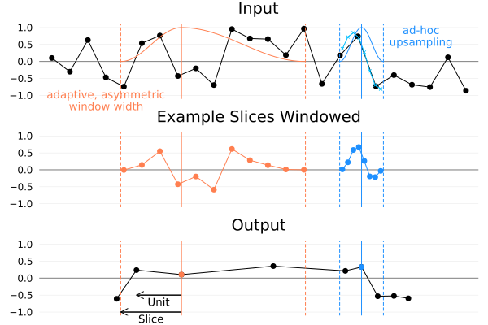

<a id='NonuniformResampling1D.jl'></a>

<a id='NonuniformResampling1D.jl-1'></a>

# NonuniformResampling1D.jl


Takes 1D data sampled at uniform intervals and resamples it at arbitrary, nonuniform locations. 


<a id='Installation'></a>

<a id='Installation-1'></a>

## Installation


The package is currently not registered, so you'll have to install it from GitHub. Open a Julia REPL and run:


```julia
]add https://github.com/Firionus/NonuniformResampling1D.jl
```


This package is not production ready. It is recommended to only use it for non-critical applications. 


<a id='Getting-Started'></a>

<a id='Getting-Started-1'></a>

## Getting Started


```julia
using NonuniformResampling1D
xin = 1:9 # input locations
yin = [1, 3, 2, 6, 7, 3, 2, 8, 3] # input values
yout = nuresample(xin, yin, [4.5, 6.2])

# output
2-element Vector{Float64}:
 6.613040058882213
 2.7151900996408322
```


<a id='Main-API'></a>

<a id='Main-API-1'></a>

## Main API

<a id='NonuniformResampling1D.nuresample' href='#NonuniformResampling1D.nuresample'>#</a>
**`NonuniformResampling1D.nuresample`** &mdash; *Function*.


```julia
nuresample(xin, yin, xout, smoothing_function; kwargs...)
```

Take data `yin` sampled at uniformly spaced locations `xin` and resample at nonuniform locations `xout`. 

**Positional Arguments**

  * `xin` is an `AbstractRange` of input locations
  * `yin` is an `AbstractArray` with the input values
  * `xout` is an `AbstractArray` with  the the increasing output locations
  * `smoothing_function` is a [`WindowFunction`](README.md#NonuniformResampling1D.WindowFunction). The width of the window function is scaled proportional to the distance to the nearest neighbor on the left and right side of the output point. At the start and end of `xout` a symmetrical window is used. The default is a rectangular window without overlap.

**Keyword Arguments**

  * `upsampling_function`: a [`WindowFunction`](README.md#NonuniformResampling1D.WindowFunction) that is used to perform upsampling when the density of input points is not high enough compared to the density of output points. The default is Lanczos3.
  * `required_points_per_slice`: the number of input points that must be in a slice (left or right half of a window) before smoothing. If the number of input points is lower than this value, upsampling is performed to create `required_points_per_slice` many points before applying the smoothing function.   The default is `round(4 * smoothing_function.width)`, which means 4 points are required per unit width to the nearest neighbor.   The minimum value is 1, in which case upsampling is only performed if no input point falls in a slice.

**Examples**

```julia-repl
julia> nuresample(1:9, 1:9, [4.2, 6.2])
2-element Vector{Float64}:
 4.201106036510037
 6.201106036510037
```

```julia-repl
julia> nuresample(1:9, 1:9, [4.2, 6.2], 
        rect_window(.5), # moving average without overlap
        required_points_per_slice = 1, # no upsampling
        upsampling_function = lanczos_window(2)) # Lanczos2 interpolation if a slice were empty
2-element Vector{Float64}:
 4.5
 6.5
```

**Output Type**

Returns an `Array{Float64, 1}`. Other output types are currently unsupported. 


<a target='_blank' href='https://github.com/Firionus/NonuniformResampling1D.jl/blob/cb89ab77a1d10cef7790936c3e45aeeaacdd302f/src/NonuniformResampling1D.jl#L11-L65' class='documenter-source'>source</a><br>


<a id='Window-Functions'></a>

<a id='Window-Functions-1'></a>

## Window Functions




<a id='NonuniformResampling1D.rect_window' href='#NonuniformResampling1D.rect_window'>#</a>
**`NonuniformResampling1D.rect_window`** &mdash; *Function*.


```julia
rect_window(width = 0.5)
```

Rectangular window which is 1 from 0 to `width` and 0 otherwise. 

Can be used to calculate a moving average, for example.


<a target='_blank' href='https://github.com/Firionus/NonuniformResampling1D.jl/blob/cb89ab77a1d10cef7790936c3e45aeeaacdd302f/src/window_functions.jl#L5-L11' class='documenter-source'>source</a><br>

<a id='NonuniformResampling1D.hann_window' href='#NonuniformResampling1D.hann_window'>#</a>
**`NonuniformResampling1D.hann_window`** &mdash; *Function*.


```julia
hann_window(width = 1)
```

Hann window (raised cosine) that is 1 at 0 and reaches 0 at `width`.


<a target='_blank' href='https://github.com/Firionus/NonuniformResampling1D.jl/blob/cb89ab77a1d10cef7790936c3e45aeeaacdd302f/src/window_functions.jl#L14-L18' class='documenter-source'>source</a><br>

<a id='NonuniformResampling1D.tri_window' href='#NonuniformResampling1D.tri_window'>#</a>
**`NonuniformResampling1D.tri_window`** &mdash; *Function*.


```julia
tri_window(width = 1)
```

Triangular window which is 1 at 0 and reaches 0 at `width`. 

Can be used to perform linear interpolation when used as upsampling_function with `width=1`. 


<a target='_blank' href='https://github.com/Firionus/NonuniformResampling1D.jl/blob/cb89ab77a1d10cef7790936c3e45aeeaacdd302f/src/window_functions.jl#L34-L41' class='documenter-source'>source</a><br>

<a id='NonuniformResampling1D.kaiser_window' href='#NonuniformResampling1D.kaiser_window'>#</a>
**`NonuniformResampling1D.kaiser_window`** &mdash; *Function*.


```julia
kaiser_window(width = 1.2; alpha = 3.5)
```

Kaiser window cut off at `width` with the shape parameter `alpha`.


<a target='_blank' href='https://github.com/Firionus/NonuniformResampling1D.jl/blob/cb89ab77a1d10cef7790936c3e45aeeaacdd302f/src/window_functions.jl#L24-L28' class='documenter-source'>source</a><br>

<a id='NonuniformResampling1D.lanczos_window' href='#NonuniformResampling1D.lanczos_window'>#</a>
**`NonuniformResampling1D.lanczos_window`** &mdash; *Function*.


```julia
lanczos_window(lobes = 3; width = 1)
```

Lanczos window which is 1 at 0 and 0 at 1*`width`, 2*`width`, 3*`width`, ...

The higher the number of lobes, the higher the accuracy of sinc approximation. 


<a target='_blank' href='https://github.com/Firionus/NonuniformResampling1D.jl/blob/cb89ab77a1d10cef7790936c3e45aeeaacdd302f/src/window_functions.jl#L47-L53' class='documenter-source'>source</a><br>


<a id='Custom-Window-Functions'></a>

<a id='Custom-Window-Functions-1'></a>

### Custom Window Functions


To define your own window functions, take a look at the examples in [window_functions.jl](https://github.com/Firionus/NonuniformResampling1D.jl/blob/main/src/window_functions.jl) and use the exported `WindowFunction` type:

<a id='NonuniformResampling1D.WindowFunction' href='#NonuniformResampling1D.WindowFunction'>#</a>
**`NonuniformResampling1D.WindowFunction`** &mdash; *Type*.


```julia
WindowFunction(_f::Function, width)
```

A radial window function. 

It is defined by the callback `_f` between x = 0 (center) and x = `width`. x=1 is the position of the nearest neighbor and the range x ∈ [0,1] is called a unit.

**Fields**

  * `_f<:Function`

Callback defining the window function. 

It will be called as `_f(x::Real)` and is expected to return a `Real` number. `x` can be expected to go from 0 (center of window) to `width`. `x` values above `width` will return 0 without calling `_f`. 

By convention, `_f(0) == 1`. If orthogonality to the nearest neighbor is desired, it should return `_f(1) == 0`. 

  * `width<:Real`

Value up to which the callback function will be evaluated. 

`width` must be bigger than 0. A `width` of 1 means that the window function is evaluated up to the nearest neighbor. 

**Examples**

```julia-repl
julia> rectangular_window = WindowFunction(x -> 1., 0.5)
WindowFunction{var"#1#2", Float64}(var"#1#2"(), 0.5)

julia> rectangular_window(.4)
1.0

julia> rectangular_window(.6)
0.0
```


<a target='_blank' href='https://github.com/Firionus/NonuniformResampling1D.jl/blob/cb89ab77a1d10cef7790936c3e45aeeaacdd302f/src/WindowFunction.jl#L3-L44' class='documenter-source'>source</a><br>


<a id='Resampling-Approach'></a>

<a id='Resampling-Approach-1'></a>

## Resampling Approach


The basic idea of the provided algorithm is that the output value at any location should be given by a weighted average of input values in a region around the output point, where the weight is given by a window function. The supporting region is called a slice and is proportional in size to the distance to the next neighbor. The ratio between slice width and distance to the nearest neighbor is the window function width and determines how strong the smoothing is. 


Further, if there are few points in a slice, the result might not be accurate. Therefore, ad-hoc resampling is used. So if the left or right slice of an output point contains less points than specified, upsampling on a regular grid is performed for both slices. 


Consider an example with 


```julia
nuresample(xin, yin, xout, hann_window(1.35), required_points_per_slice = 4)
```


which can be visualized like this:





The orange output point shows how the window function and supporting regions are scaled asymmetrically around the output point, depending on how far the neighboring output points are away. The input values and the window function are multiplied pointwise, resulting in the windowed slices shown in the second plot from the top. The normalized average of these points is the orange output value. 


The blue point shows the dynamic upsampling. since its slices contain less than 4 points, upsampling is applied before applying the window function. The default upsampling function Lanczos3 is used to create the points in bright blue. They are created with uniform step size. The upsampled points are then weighted with the window function and the normalized average forms the blue output value. 


Upsampling is performed for both slices, even if only one of them has too few points. This ensures that the weight between the two slices stays approximately even. The upsampling step is the same between the two slices and is chosen such that `required_points_per_slice` are created in the smaller of the two slices.


<a id='Examples'></a>

<a id='Examples-1'></a>

## Examples


I originally wrote this package to perform logarithmic smoothing. A demo notebook is available at [https://github.com/Firionus/logarithmic_smoothing_julia_demo](https://github.com/Firionus/logarithmic_smoothing_julia_demo). 


<a id='Getting-Help'></a>

<a id='Getting-Help-1'></a>

## Getting Help


If you have any problems or feedback, please [open an issue](https://github.com/Firionus/NonuniformResampling1D.jl/issues/new). 

